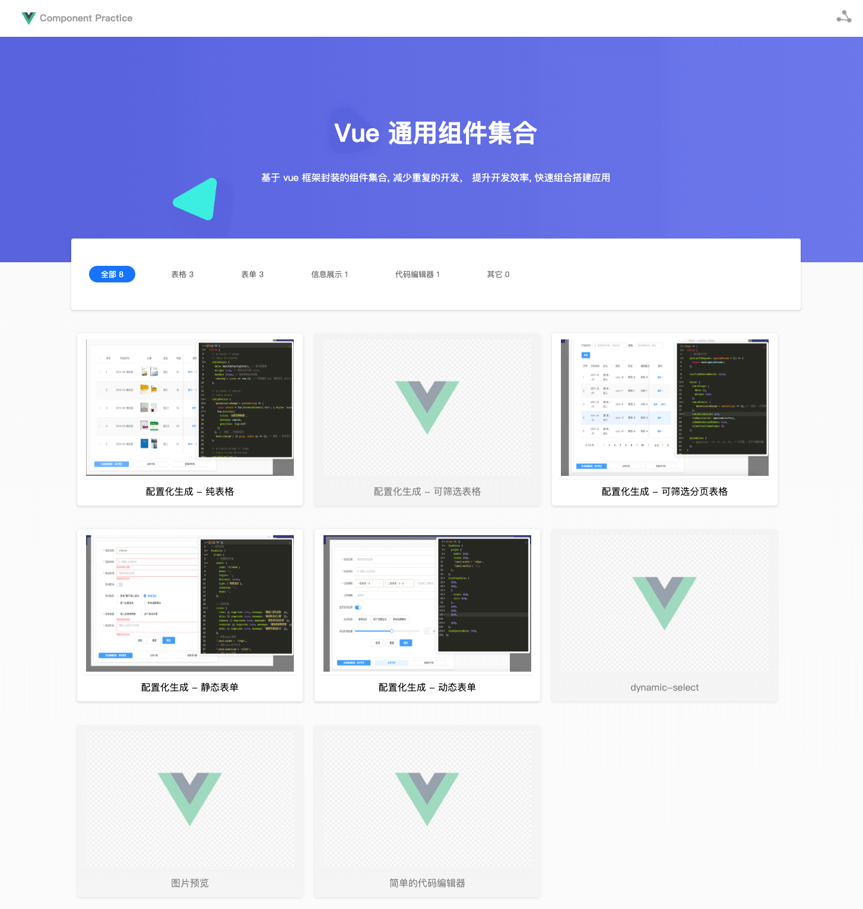

# vue-components-practices

基于 vue 组件的封装实践, 集中展示了一些**通过配置化生成**、**纯 UI 组件**、**满足相关业务场景** 的组件。减少重复的开发， 提升开发效率, 快速组合搭建应用。

### 说明

> 项目起因，纯粹是为了沉淀曾经写过或是曾遇到过的一些场景和好的组件封装案例。

> 以上所有组件封装，均基于 [Vue.js](https://cn.vuejs.org/)

> 该展示集合，将陆续整理发布，持续更新。

> 如果觉得对您有帮助，欢迎 star O(∩_∩)O~~。

### 图例

**[「 preview 」](https://cllemon.github.io/vue-components-practices/)**



### Project setup

```
yarn install
```

#### Compiles and hot-reloads for development

```
yarn run serve
```

#### Compiles and minifies for production

```
yarn run build
```

#### Customize configuration

See [Configuration Reference](https://cli.vuejs.org/config/).
